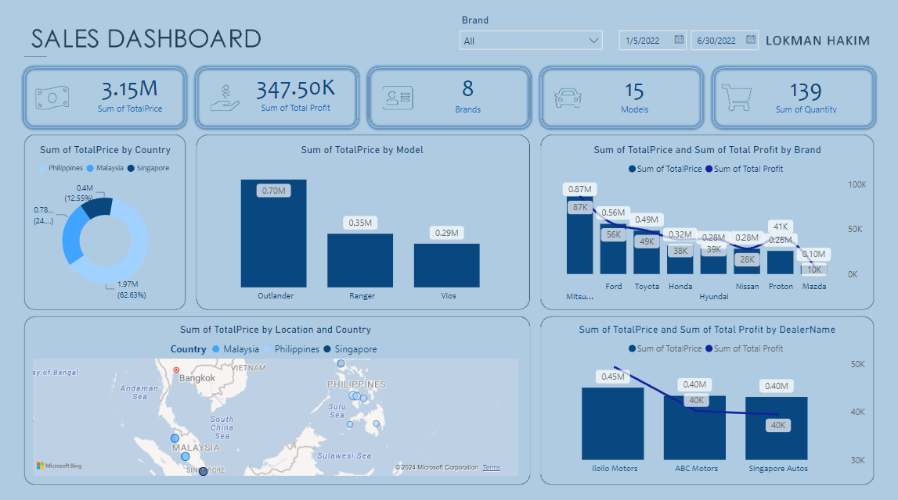
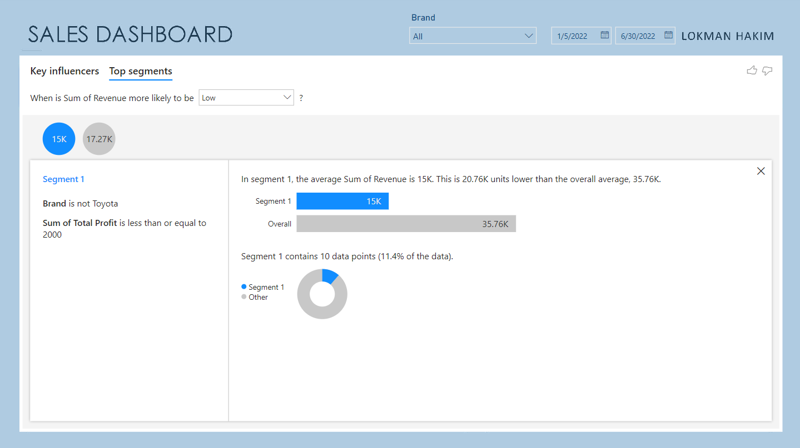
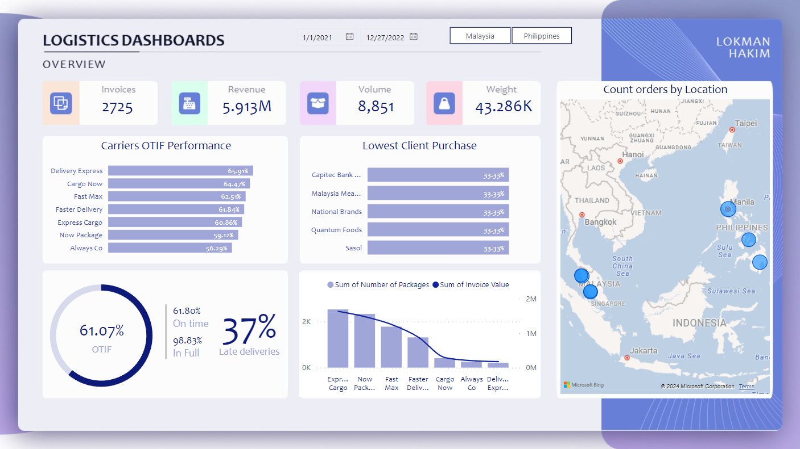

# PowerBI-Visuals
Delve into impactful data visualizations powered by BI tools. Explore dynamic charts, graphs, and dashboards revealing actionable insights derived from comprehensive data analysis.

### Introduction
 I have embarked on an enlightening journey through the Exodus Expert Class for Power BI, and I'm thrilled to share my experiences and newfound expertise with you. In today's data-driven world, Power BI stands as a beacon of empowerment, offering unparalleled capabilities to transform raw data into actionable insights. Join me as I delve into the intricacies of Power BI, exploring its functionalities, unraveling its complexities, and uncovering the secrets to harnessing its full potential. Whether you're a seasoned data analyst or a curious beginner, this blog aims to be your guide, your companion, and your source of inspiration on the path to mastering Power BI. Let's embark on this transformative journey together!I have attended Exodus Expert Class which 

**In Short**
1. Data collection.
2. Data preprocessing.
3. Selection of visualization types.
4. Designing visual elements.
5. Interpreting insights.
6. Communicating findings effectively.

### Sample of my project

 **Top Cars Sales Performance**

**Logistics Company Sales Performance**

